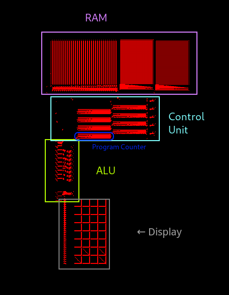

## CPU Components
The processor has 4 main parts: the control unit, the arithmetic logic unit, the display and the RAM. Here they are labelled on the actual processor:

# The Instruction Cycle

The execution of each instruction has 2 parts: 

### The Instruction Fetch
First, an address is read from program counter.
The CU then sequentially fetches data from 5 consecutive memory cells starting at that address. Once all the data has been read, 4 values are sent towards the ALU, and 1 of the values is stored in the program counter.

### The ALU

Once the data has arrived with the timing bit, the ALU decodes the opcode and uses a demultiplexer to select the right instruction.

The data is then processed, and the output is sent towards the ram along with an address for writing. If it is a display instruction, then the data is sent to the display.

Then, a timing bit is sent back to the CU to start the cycle all over again.
