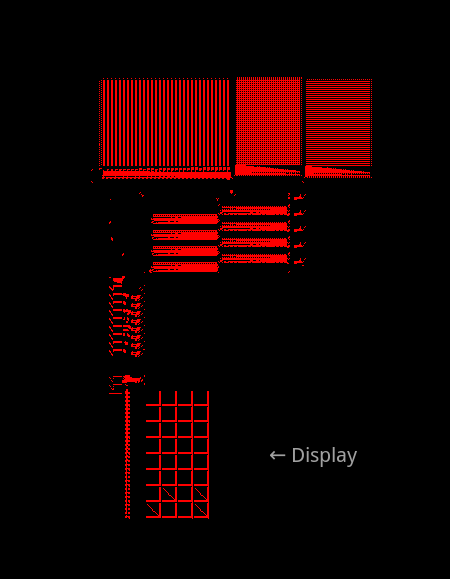
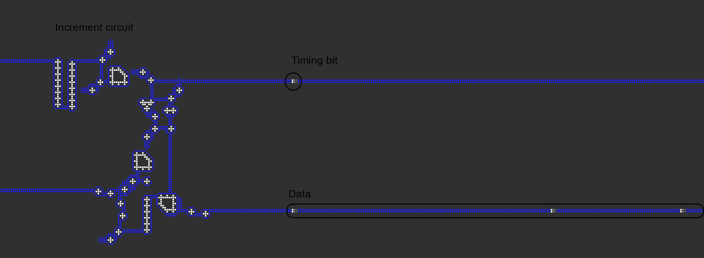

# droid-logica
The droid logica is 32-bit computer processor (and display) that has been designed to run in the Star Wars cellular automata.

[Star wars](https://conwaylife.com/wiki/OCA:Star_Wars) is a famous 'generations' cellular automata which was first discovered by Mirek Wójtowicz. It can be run using any cellular automata simulator that supports hashlife and generations rules, like [Golly](https://golly.sourceforge.io).

## Technical Details

This computer follows completely asynchronous , 32-bit Von Neumann type architechture, where the data and the instructions are stored in the same memory. It is designed to work without any clocks, so every piece of data is accompanied by a timing bit. 

This processor uses a slightly esoteric, but still usable instruction set. The main features of the instruction set are self-modifying code and variable length instruction. This is what allows it to be practical to code in.

 To simplify its implementation, all the instruction's arguments only support the immediate addressing mode. Although this may seem like a big drawback, this can remedied by clever usage of self-modifying code.

 The numbers are all stored using 2's complement. There is a cmov instruction, which writes a value if the input is &ge; 0. This, along with self modifying code allows one to perform loops and conditional jumps.

Its display is currently very primitive and ugly looking, and I am hoping to design a better one someday.

In order to learn the nitty gritty details of how to program this thing and how the instructions are coded, go to  [INSTRUCTIONS.md](INSTRUCTIONS.md)

## Running
To simply run the demos, you only need [Golly](https://golly.sourceforge.io). Run with Hyperspeed enabled.

To compile your own programs, run `scripts/make_processor.py`, and give the input assembly file and output file as command line arguments.

You will need to have the python libraries [lifelib](https://pypi.org/project/python-lifelib) and [lark](https://pypi.org/project/lark) installed in order to run it, since this program uses both of them.

## Demonstration

To show its usability, I have made 2 programs. One of them calculates prime numbers from 5 onwards.
The other calculates the fibonacci numbers.

These ready-made ones can be found in the [demos](demos)  folder

The display output needs to be interpreted in binary, reading from left to right, top to bottom.

## Acknowledgements

I would like thank everyone on the conwaylife forums [thread](https://conwaylife.com/forums/viewtopic.php?t=507) on starwars. Many of the logic gates and other basic components used here have been adapted from there.